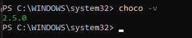
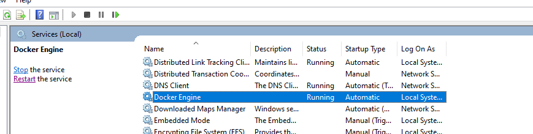
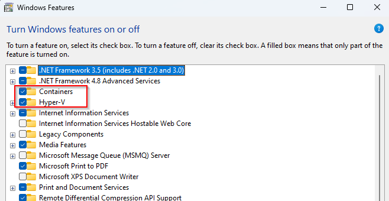
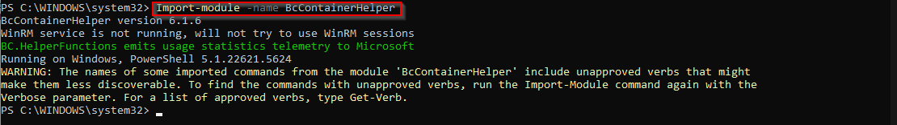

# Creating a Business Central Container with Docker Engine

To create a **Business Central container**, you must have the **Docker Engine** running on your system.

---

## Install Docker Engine

There are two main ways to get Docker Engine running on Windows:

- **Docker Desktop**: Installing Docker Desktop automatically includes the Docker Engine.
- **Docker Engine Only (without Docker Desktop)**: If you prefer not to use Docker Desktop, follow these steps:

### 1. Install Chocolatey (Package Manager)

Open PowerShell as **Administrator** and run:

`Set-ExecutionPolicy Bypass -Scope Process -Force; [System.Net.ServicePointManager]::SecurityProtocol = [System.Net.ServicePointManager]::SecurityProtocol -bor 3072; iex ((New-Object System.Net.WebClient).DownloadString('https://community.chocolatey.org/install.ps1'))`

### 2. Install Docker Engine via Chocolatey

After Chocolatey is installed, install Docker Engine:

`choco install docker-engine -y -Force`

### 3. Start Docker Engine Service

- Go to **Services**.
- Find **Docker Engine**.
- Click on **Start** to run the service.

**Note:** On some Windows setups, you may need to set the service to start automatically or use Task Scheduler to ensure Docker Engine starts after a reboot.

---

## Enable Required Windows Features

**Business Central** containers require both **Hyper-V** and **Containers** features.

- Open PowerShell as Administrator and run:

`Enable-WindowsOptionalFeature -Online -FeatureName $("Microsoft-Hyper-V", "Containers") -All`

If you don't have these features, you can run `containers.bat` and `hyperv.bat` scripts as administrators, and these features will be added to your system.

---

## Install BcContainerHelper

**BcContainerHelper** is a PowerShell module essential for creating and managing Business Central containers.

### 1. Install the Module

`Install-Module -Name BcContainerHelper`

### 2. Import the Module

`Import-Module -Name BcContainerHelper`

Once the BcContainerHelper Module is imported you can run the script createbccontainer.ps1 

For license I have added a Demo License File(Cronus.bclicense) which you can download and provide the path for variable $licenseFile

---

## Summary of Steps

- **Install Docker Engine** (either via Docker Desktop or Chocolatey).
- **Enable Hyper-V and Containers features**.
- **Install and import BcContainerHelper PowerShell module**.

You are now ready to create and manage **Business Central containers** on your system.
